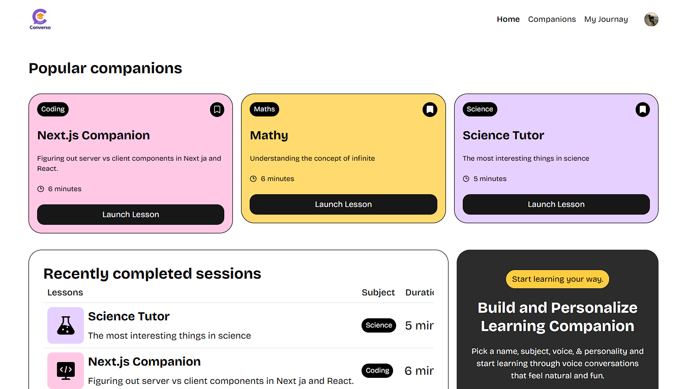
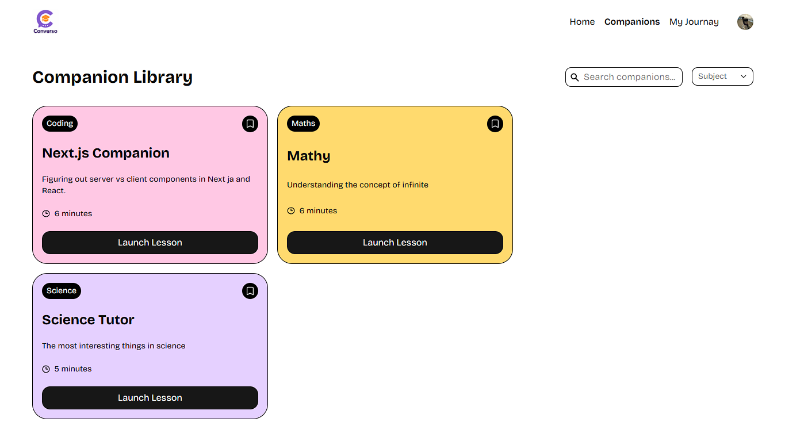
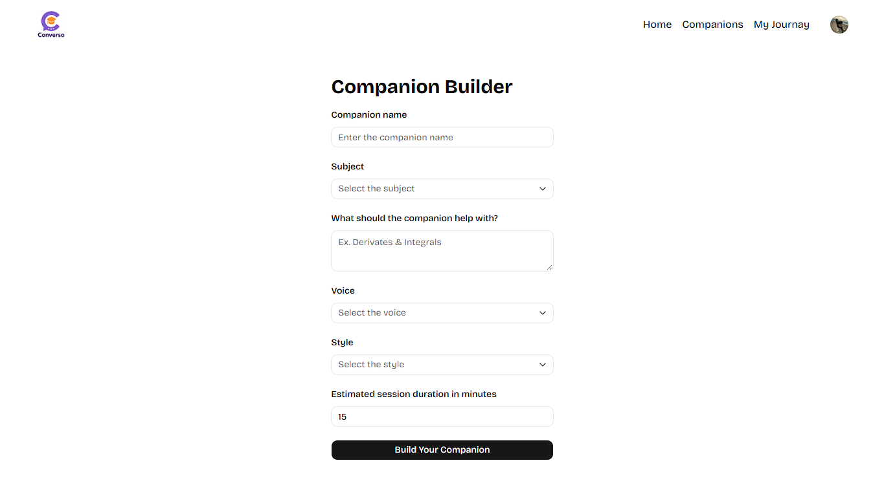
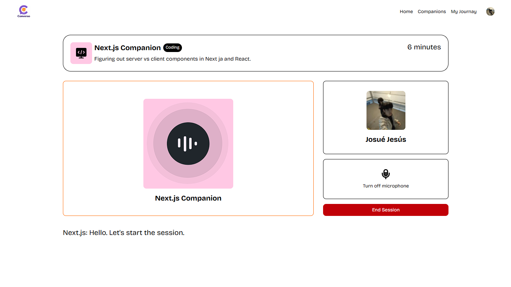
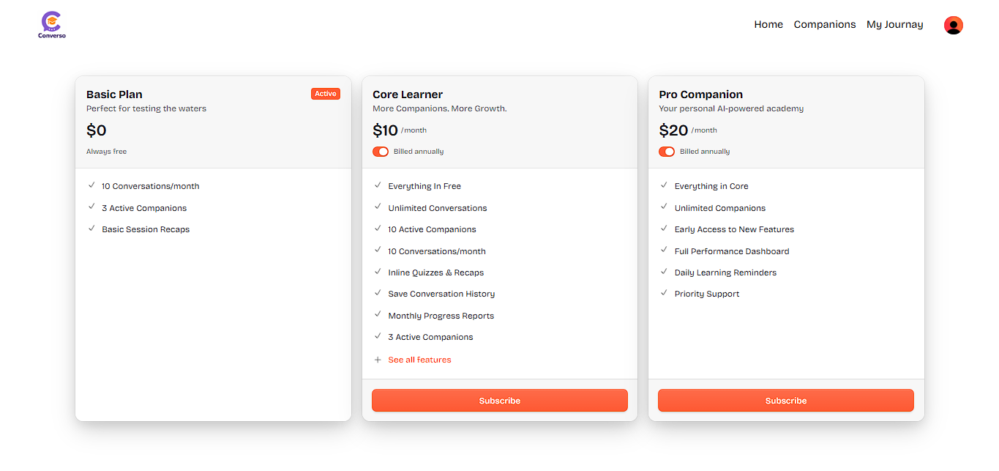

# Converso — AI Voice Learning Companion SaaS

An interactive voice-first SaaS platform that pairs learners with customizable AI study companions for real-time, conversational tutoring sessions.

Traditional digital learning is predominantly passive and text-dense, which often leads to study fatigue and low knowledge retention. Converso solves this by turning subjects into interactive, spoken dialogue—allowing students to build personalized voice tutors, practice concepts out loud, and track their progress through an adaptive learning journey.

---

## Demo

- **Live Deployment:** `https://saas-app-zeta-ashy.vercel.app/`

---

## Screenshots

> Place application screenshots in `docs/screenshots/` to showcase the UI in this section:

|     Home & Popular Companions      |            Companion Library             |
| :--------------------------------: | :--------------------------------------: |
|  |  |

|          Companion Builder Form          |               Live Voice Session               |
| :--------------------------------------: | :--------------------------------------------: |
|  |  |

|               Subscription & Pricing               |
| :------------------------------------------------: |
|  |

---

## Features

- **Real-Time Voice Tutoring:** Conversational voice sessions powered by the Vapi AI Web SDK, integrating Deepgram speech recognition, ElevenLabs voice synthesis, and OpenAI GPT-5.
- **Custom Companion Builder:** Create tutors tailored to specific subjects (`maths`, `language`, `science`, `history`, `coding`, `economics`), topics, voice personas (male/female), and speaking styles (casual/formal).
- **Companion Library & Exploration:** Explore public companions with real-time text search (500ms debounce), subject category filters, and color-coded subject tags.
- **Interactive Call Controls & Live Transcripts:** Live microphone toggle, connection state indicators, animated audio waveforms (Lottie), and real-time conversation transcription history.
- **Bookmarks & Learning Dashboard ("My Journey"):** Save favorite companions, inspect completed lesson counts, track created companions, and review recent session history using accessible accordion views.
- **Tiered Access & Quota Enforcement:** Tiered companion creation limits (`3_companion_limit`, `10_companion_limit`, or unlimited `pro`) managed via Clerk user claims and enforced at the server action layer.
- **Integrated Billing:** Subscription management and plan upgrades powered by Clerk's `<PricingTable />` integration.
- **Production Observability:** Client, server, and edge error monitoring with session replay and performance tracing via Sentry.

---

## Tech Stack

| Technology                      | Purpose in Converso                                                                        |
| :------------------------------ | :----------------------------------------------------------------------------------------- |
| **Next.js 16 (App Router)**     | Full stack framework with Server Components, Server Actions, dynamic routes, and streaming |
| **React 19**                    | Modern UI layer using concurrent features, hooks, and responsive client state              |
| **TypeScript 5**                | Strict end-to-end type safety across server actions, components, and external SDKs         |
| **Tailwind CSS v4 & shadcn/ui** | Design system and accessible primitives (Base UI, Lucide icons, animations)                |
| **Supabase (PostgreSQL)**       | Relational database storing companions, session history, and user bookmarks                |
| **Clerk + Stripe**              | User authentication, session management, RBAC feature claims, and subscription pricing     |
| **Vapi AI Web SDK**             | Low-latency voice streaming orchestration (Deepgram Nova-3 + ElevenLabs + OpenAI GPT-4)    |
| **Sentry**                      | Full stack error monitoring, performance tracing, and browser session replays              |
| **Vercel**                      | Edge runtime deployment, automatic preview environments, and production hosting            |
| **React Hook Form + Zod**       | Type-safe form validation for companion configuration and duration constraints             |

---

## Project Structure

```text
saas-app/
├── app/                              # Next.js App Router
│   ├── api/                          # Route handlers (Sentry example, webhooks)
│   ├── companions/                   # Companion routes: library, detail session [id], builder (new)
│   ├── my-journey/                   # User dashboard: bookmarks, history, metrics
│   ├── subscription/                 # Billing page with Clerk PricingTable
│   ├── layout.tsx                    # Root layout with Navbar and Clerk provider
│   └── page.tsx                      # Home page (popular companions, recent activity, CTA)
├── components/                       # UI & domain components
│   ├── ui/                           # Reusable design system primitives (Accordion, Select, etc.)
│   ├── CompanionCard.tsx             # Card preview with bookmark toggling
│   ├── CompanionComponent.tsx        # Voice session interface with Vapi lifecycle & transcripts
│   ├── CompanionForm.tsx             # Validated companion builder form
│   └── SearchInput.tsx               # Debounced search bar for library filtering
├── constants/                        # Subject colors, voice mappings, and preset data
├── lib/
│   ├── actions/                      # Server Actions (CRUD, permissions, bookmarks, history)
│   ├── supabase.ts                   # Authenticated Supabase client (scoped via Clerk JWT)
│   ├── utils.ts                      # Assistant system prompt builder and Tailwind merge helper
│   └── vapi.sdk.ts                   # Vapi Web client singleton
├── e2e/                              # Playwright E2E tests and auth setup
└── types/                            # Global TypeScript definitions
```

---

## Getting Started

### Prerequisites

- **Node.js**: v20 or higher
- **npm**: v10 or higher
- Free development accounts on **Clerk**, **Supabase**, and **Vapi**

### 1. Clone & Install Dependencies

> **Note on `--legacy-peer-deps`:** Required during installation to resolve a peer dependency mismatch between `@vitejs/plugin-react` (used by Vitest) and React 19.

```bash
git clone https://github.com/urjos/saas-app.git
cd saas-app
npm install --legacy-peer-deps
npx playwright install chromium
```

### 2. Configure Environment Variables

Copy the provided example file and populate your keys:

```bash
cp .env.example .env.local
```

| Variable                                          | Description                                               | Source                                                      |
| :------------------------------------------------ | :-------------------------------------------------------- | :---------------------------------------------------------- |
| `NEXT_PUBLIC_CLERK_PUBLISHABLE_KEY`               | Clerk public key for client-side authentication           | [Clerk Dashboard](https://dashboard.clerk.com/)             |
| `CLERK_SECRET_KEY`                                | Clerk secret key for backend auth and permissions         | [Clerk Dashboard](https://dashboard.clerk.com/)             |
| `NEXT_PUBLIC_CLERK_SIGN_IN_URL`                   | Redirect path for unauthenticated users (`/sign-in`)      | Set to `/sign-in`                                           |
| `NEXT_PUBLIC_CLERK_SIGN_IN_FALLBACK_REDIRECT_URL` | Fallback route after signing in                           | Set to `/`                                                  |
| `NEXT_PUBLIC_CLERK_SIGN_UP_FALLBACK_REDIRECT_URL` | Fallback route after signing up                           | Set to `/`                                                  |
| `NEXT_PUBLIC_SUPABASE_URL`                        | Project URL for Supabase PostgreSQL instance              | [Supabase Project Settings](https://supabase.com/dashboard) |
| `NEXT_PUBLIC_SUPABASE_PUBLISHABLE_KEY`            | Anon public API key for Supabase client queries           | [Supabase Project Settings](https://supabase.com/dashboard) |
| `NEXT_PUBLIC_VAPI_WEB_TOKEN`                      | Public web token for browser voice sessions               | [Vapi AI Dashboard](https://dashboard.vapi.ai/)             |
| `SENTRY_AUTH_TOKEN`                               | Optional auth token to upload source maps during build    | [Sentry Settings](https://sentry.io/)                       |
| `E2E_CLERK_USER_EMAIL`                            | Email of a test user in your Clerk Dev instance (for E2E) | Clerk Dashboard > Users                                     |

### 3. Run the Development Server

```bash
npm run dev
```

Open [http://localhost:3000](http://localhost:3000) to view the application.

---

## Available Scripts

Defined in `package.json`:

| Script             | Command           | Description                                                |
| :----------------- | :---------------- | :--------------------------------------------------------- |
| `npm run dev`      | `next dev`        | Starts local Next.js development server with hot-reload    |
| `npm run build`    | `next build`      | Creates optimized production build with Sentry source maps |
| `npm run start`    | `next start`      | Runs production server locally after build                 |
| `npm run lint`     | `eslint`          | Executes ESLint static code analysis                       |
| `npm run test`     | `vitest`          | Runs unit and component tests in interactive watch mode    |
| `npm run test:run` | `vitest run`      | Runs unit and component tests once (CI mode)               |
| `npm run test:e2e` | `playwright test` | Runs end-to-end tests across headless browsers             |

---

## Testing

The testing architecture separates unit/component verification from browser-level user journey automation:

### Test Coverage Summary

- **Unit & Component Tests (`Vitest` + `React Testing Library`):** **5 test files, 27 tests**
  - [`lib/actions/companion.actions.test.ts`](lib/actions/companion.actions.test.ts) (5 tests): Subscription plan authorization rules in `newCompanionPermissions` (Pro bypass, 3-companion and 10-companion quotas, and database exception handling).
  - [`lib/utils.test.ts`](lib/utils.test.ts) (6 tests): Subject color mappings, assistant system prompt injection (variables `{{ topic }}`, `{{ subject }}`, `{{ style }}`), voice ID fallbacks, and Tailwind class merging.
  - [`components/CompanionCard.test.tsx`](components/CompanionCard.test.tsx) (4 tests): Card UI rendering, route links, and bookmark add/remove optimistic triggers.
  - [`components/CompanionForm.test.tsx`](components/CompanionForm.test.tsx) (4 tests): Form field rendering, Zod schema validation errors, session duration limits, and companion submission redirect.
  - [`components/CompanionComponent.test.tsx`](components/CompanionComponent.test.tsx) (8 tests): Complete voice call lifecycle (connecting, active, teardown), Vapi SDK event emission, transcript ordering, mute toggle, and listener cleanup on unmount.
- **End-to-End Tests (`Playwright` + `@clerk/testing`):** **3 test files (1 auth setup + 4 tests)**
  - [`e2e/auth.setup.ts`](e2e/auth.setup.ts): Authenticates via `@clerk/testing` token (no plain passwords) and serializes cookies/storage into `playwright/.auth/user.json`.
  - [`e2e/public.spec.ts`](e2e/public.spec.ts) (3 tests): Unauthenticated flows (popular companions on home, debounced search URL updates, and protected route redirect to `/sign-in`).
  - [`e2e/create-companion.spec.ts`](e2e/create-companion.spec.ts) (1 test): Authenticated companion creation flow and navigation to the active lesson room.

### Running Tests

```bash
# Run unit and component test suite
npm run test:run

# Run unit tests in interactive watch mode
npm run test

# Run full E2E test suite (automatically starts webServer on localhost:3000)
npm run test:e2e

# View the Playwright HTML test report
npx playwright show-report
```

### Architecture & Design Decisions

- **Isolated External Services:** Vapi, Clerk Server, and Supabase client calls are mocked in unit tests to ensure fast, zero-dependency, and deterministic test runs.
- **Reused Storage State:** Playwright's `setup` project logs in once using `@clerk/testing` and persists browser storage to `playwright/.auth/user.json`. Authenticated specs reuse this file, preventing redundant authentication calls and test flakiness.
- **Test Quotas:** Because E2E tests create real companion rows in the database, the test account defined by `E2E_CLERK_USER_EMAIL` should have an active Pro plan or sufficient quota.
- **Security:** `playwright/.auth/user.json` contains live session tokens and is ignored in `.gitignore`.
